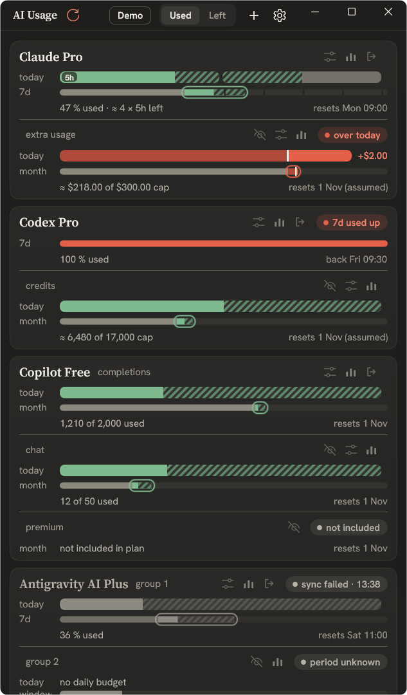
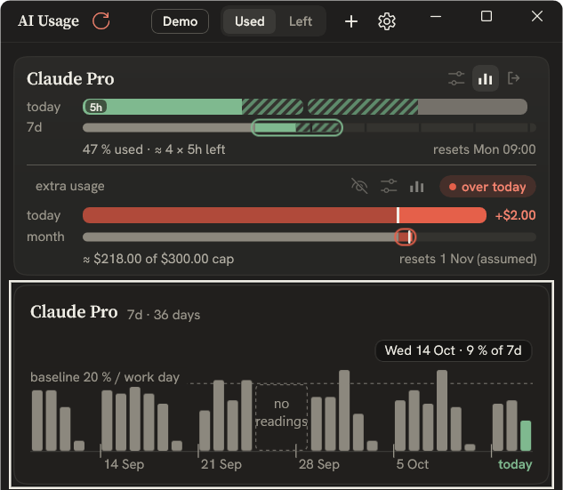
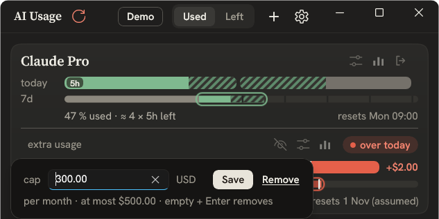
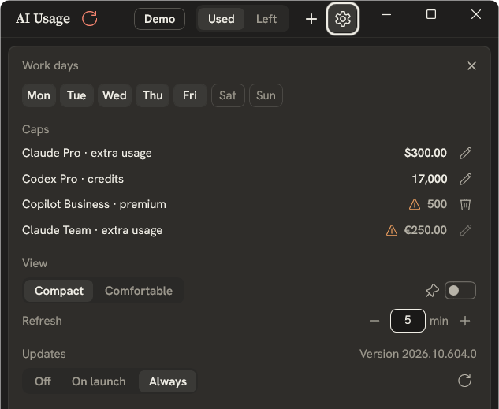

# AI Usage

**Your Claude, Codex, GitHub Copilot and Antigravity subscription limits in one Windows window.** 
See what you have used, what is left for today, and when each limit resets.

**[Download the Preview](https://rozputnii.github.io/ai-usage-app/)** ·
[Features](#features) · [Screenshots](#screenshots) · [Install](#install) · [Privacy](#privacy-and-security)

Screenshots show the built-in demo with synthetic data.

## Features

- **Every subscription in one place.** One card per account, with each limit the provider
  reports: five-hour and weekly windows, monthly requests, credits and extra usage.
- **A daily pace, not just a percentage.** A weekly or monthly limit is spread over your work
  days, so the *today* bar shows how much of today's share is used. It turns red when you
  go over.
- **Five-hour window estimates.** For Claude and Codex the app estimates how many five-hour
  windows are left in the week.
- **Personal caps.** Set your own limit for extra usage or credits, in dollars, credits or
  percent, and the bar measures against it.
- **Local history.** A bar chart of your daily use, built from readings stored on your PC.
- **Lives in the tray.** Closing the window keeps the app in the tray. It refreshes on its
  own, and a reading that failed to update is marked with the time it was taken.
- **Updates itself.** New Preview builds install through Windows App Installer, or from
  the in-app Updates setting.

## Screenshots

<table>
  <tr>
    <td align="center" valign="top" width="33%"> <b>History</b>: daily use over the last weeks</td>
    <td align="center" valign="top" width="33%"> <b>Caps</b>: your own limit for extra usage</td>
    <td align="center" valign="top" width="33%"> <b>Settings</b>: work days, refresh and updates</td>
  </tr>
</table>

## Supported providers

| Provider | What it shows | You sign in with |
| --- | --- | --- |
| **Claude** | 5-hour and 7-day windows, extra usage in dollars | Your Claude account |
| **Codex** | 5-hour and 7-day windows, credits | Your ChatGPT account |
| **GitHub Copilot** | Monthly completions, chat and premium requests | Your GitHub account |
| **Antigravity** | Quota groups and their reset times | Your Google account and your own OAuth client ([details](docs/providers/antigravity.md)) |

Several accounts of the same provider can be connected at once.

## Install

AI Usage is distributed as a **Development Preview**, signed with a self-signed test
certificate. It needs Windows 11 24H2 or later on x64.

1. Install the [.NET 10 Desktop Runtime (x64)](https://dotnet.microsoft.com/download/dotnet/10.0) if it is missing.
2. Trust the test certificate once, as described on the [install page](https://rozputnii.github.io/ai-usage-app/).
3. Open **Install AI Usage** on that page. Installing through the `.appinstaller` link keeps the app updated.

## Privacy and security

- Sign-in tokens are encrypted with Windows DPAPI for your user account and stay on your PC.
- The app has no server of its own and no telemetry. It contacts only the providers you
  connect and GitHub, for updates.
- Usage history, settings and logs are stored locally. Logs never contain tokens, and
  provider responses are sanitized before they are written.
- To report a vulnerability, see [SECURITY](SECURITY.md).

## Limitations

- **Unofficial integrations.** No provider has approved this app, and each one can change
  or block its usage endpoints at any time. Anthropic's
  [credential-use policy](https://code.claude.com/docs/en/legal-and-compliance#authentication-and-credential-use)
  does not permit third-party apps to offer Claude.ai login, and Google's
  [Antigravity FAQ](https://antigravity.google/docs/faq) says third-party access violates
  its terms. Read the [provider records](docs/providers/README.md) before connecting an account.
- **Preview signing.** Builds use a self-signed certificate rather than a publicly trusted
  one, so Windows asks you to trust it explicitly.
- **Windows only**, x64, dark theme.

## Development

Building from source, checks and the release channel are covered in
[docs/development.md](docs/development.md).

## License

[MIT](LICENSE)
